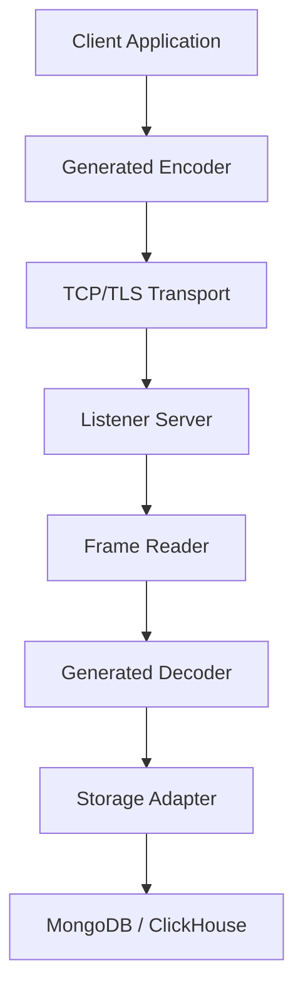

**Distributed Logger is a code-generated high-performance event logging system for distributed C/C++ applications.**

High-performance structured event logging for distributed C/C++ systems.

Define events once in a header file and automatically generate:

• strongly-typed client logging APIs
• server decoders
• storage pipelines

Events are transmitted via a minimal binary protocol and ingested into
scalable backends such as MongoDB and ClickHouse.

Designed for high-throughput distributed systems where traditional logging
becomes a bottleneck.

`Example

Define events in a header:

#pragma once

void LogEvent(uint64_t shard, std::string host);

Generate code:

./tools/run_parser.sh events.hh

Use the generated API:

Logger<MyBuffer, MyIO> logger(io);

logger.LogEvent(3, "node-1");`

**The flow:**
1. A client constructs one or more Logger's instances. Internally a connection to event server is initiated
2. A client calls logger.LogEvent
3. the encoder (in the same call) encodes (binary) the parameters into a buffer
4. Depending on choosen IO (customizable), it can be sent right away or be enqueued (and sent once a connection becomes writable)
5. The event server receives the data and decodes
6. The decoded data is written to the configured storage

**Why Distributed Logger Exists**

Traditional logging systems often suffer from:

• high runtime overhead
• unstructured text logs
• difficult cross-service correlation
• limited support for high-performance C/C++ systems

Distributed Logger treats logs as structured events transmitted
efficiently to centralized storage.

**Key Features**
⚡ **High-Performance Event Logging**

* Minimal binary wire protocol

* Append-only ingestion pipeline

* Designed for high-throughput distributed systems

🧬 **Code-Generated Logging APIs**

* Users define events via simple C++ header declarations

* Generator produces strongly-typed client and server logic

* Eliminates runtime reflection and schema mismatches

🗄 **Pluggable Storage Backends**

Currently supported:

* MongoDB

* ClickHouse

Architecture supports adding new backends without modifying client code.

🔌 **Customizable Transport and Buffering**

* TCP and TLS support

* User-replaceable IO and buffer implementations

* Seastar compatible

🧵 **Scalable Ingestion Pipeline**

* Worker-based batching

**When To Use Distributed Logger**

Distributed Logger is particularly useful for:

* High-performance distributed services

* Systems requiring structured event analysis

- C/C++ infrastructure or backend services

* Performance monitoring and troubleshooting pipelines

* Systems where log queryability is critical

**When Not To Use It**

Distributed Logger is **not** intended to replace:

* General purpose logging frameworks (spdlog, log4j, etc.)

* Metrics/observability stacks like OpenTelemetry

* Real-time alerting systems

It is optimized for **structured event capture and post-analysis.**

**Architecture Overview**

Full architecture details are available in docs/architecture.md.

**Quick Start**
`1. Define events

#pragma once
void LogEvent(uint64_t event0, uint64_t shard, std::string host);
void LogEvent(uint64_t event1, uint64_t shard, std::string host, uint64_t timestamp);

2. Generate code

./tools/run_parser.sh ./examples/example_header.hh

3. Start server

cd server/main
go run . general_config.json

4. Run example client

./examples/async_logging/bin/async_logging [options]`

**Options**

`--host` - an IP address of the server

`--port` - a port number the server listens to

`--certificate` - a client's certificate file path

`--key` - a client's key file path

`--trusted` - a trusted certificate file path (when using self-generated certificates)

`--time` - for how long to run

`--size` - how big can the event logging queue grow (in bytes)

**Project Layout**

client/  C++ client libraries

server/  ingestion server

generated/  code generated from event headers

examples/  example clients

tools/  code generator

docs/  architecture and design documentation

**Client Language Support**
|Language| Status|
|--------|-------|
|C++|   ✓ stable|
|Go|    planned|
|Python| planned|

**Storage Model**

Supported storage backends

• MongoDB

• ClickHouse

See docs/storage.md for architecture and configuration details.

**Customization**
See docs/customization.md for details.

**Protocol Overview**
Events are transmitted using a lightweight binary frame:

`[uint32 packet_length]
[uint64 event_id]
[payload...]`

Payload encoding is generated based on user-defined event signatures.

Full specification: docs/protocol.md

**Design Goals**

Distributed Logger is built around a small set of core design principles:

• Minimal runtime overhead  
  Logging must not become a bottleneck in high-performance services.

• Strongly typed events  
  Event schemas are defined once and enforced through generated APIs.

• Storage independence  
  Client applications remain unaware of the storage backend.

• High ingestion throughput  
  The system is optimized for large event volumes in distributed systems.

• Simple operational model  
  Minimal configuration and predictable runtime behavior.

**Project Status**

Distributed Logger is currently in early development.

Implemented:

✓ C++ client API generator  
✓ TCP/TLS transport  
✓ MongoDB storage backend  
✓ ClickHouse storage backend  
✓ Example clients (POSIX, epoll, Seastar)

Planned:

• Go client support
• Python client support
• additional storage backends
• performance tuning for ClickHouse ingestion

**Typical Use Cases**

Distributed Logger is useful in systems such as:

• distributed databases
• high-performance backend services
• trading or real-time processing systems
• microservice infrastructures requiring event correlation
• performance analysis pipelines

Example events:

• request lifecycle tracking
• shard-level performance metrics
• replication events
• internal state transitions

**Contributing**

Contributions are welcome, including:

* Additional storage backends

* Client language generators

**License**

This project is licensed under the Apache License 2.0.

You are free to use, modify, and distribute this software, including in commercial products.

The license includes an explicit patent grant from contributors, which helps protect users and adopters of the project.

See the LICENSE file for full details.

* Performance improvements

* Documentation enhancements

See CONTRIBUTING.md.
