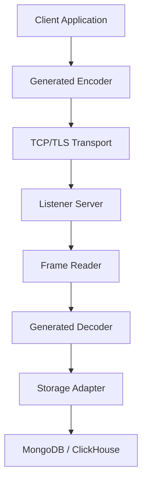

**Distributed Logger**

High-performance structured event logging for distributed C/C++ systems with pluggable storage backends and code-generated APIs.

Distributed Logger is designed for systems where traditional logging becomes a performance bottleneck or lacks structured query capabilities. It provides a lightweight wire protocol, generated strongly-typed logging APIs, and scalable ingestion pipelines targeting databases such as MongoDB and ClickHouse.

**Why Distributed Logger Exists**

Modern distributed services generate large volumes of diagnostic and performance data. Traditional logging approaches often suffer from:

* High runtime overhead

* Poor structure and queryability

* Difficult correlation across machines and threads

* Limited support for high-performance C/C++ environments

* Tight coupling between logging format and storage backend

Distributed Logger addresses these challenges by treating logs as **structured events** transmitted efficiently to centralized storage.

**Key Features**
⚡ **High-Performance Event Logging**

* Minimal binary wire protocol

* Append-only ingestion pipeline

* Designed for high-throughput distributed systems

🧬 **Code-Generated Logging APIs**

* Users define events via simple C++ header declarations

* Generator produces strongly-typed client and server logic

* Eliminates runtime reflection and schema mismatches

🗄 **Pluggable Storage Backends**

Currently supported:

* MongoDB

* ClickHouse

Architecture supports adding new backends without modifying client code.

🔌 **Customizable Transport and Buffering**

* TCP and TLS support

* User-replaceable IO and buffer implementations

* Seastar compatible

🧵 **Scalable Ingestion Pipeline**

* Worker-based batching

**When To Use Distributed Logger**

Distributed Logger is particularly useful for:

* High-performance distributed services

* Systems requiring structured event analysis

- C/C++ infrastructure or backend services

* Performance monitoring and troubleshooting pipelines

* Systems where log queryability is critical

**When Not To Use It**

Distributed Logger is **not** intended to replace:

* General purpose logging frameworks (spdlog, log4j, etc.)

* Metrics/observability stacks like OpenTelemetry

* Real-time alerting systems

It is optimized for **structured event capture and post-analysis.**

**Architecture Overview**

**Design Principle**

Only the decoder layer interacts with wire format.
Storage layers operate on strongly typed event structures.

**Quick Start**
1. **Define Event API**

Example event definition:

`#pragma once`

`void LogEvent(uint64_t event0, uint64_t shard, std::string host);`

 `void LogEvent(uint64_t event1, uint64_t shard, std::string host, uint64_t timestamp);`

2. **Generate Client & Server Code**

From the project root:

`./tools/run_parser.sh ./examples/example_header.hh`

This will:

* Parse the event schema in example_header.hh

* Generate client encoders

* Generate server decoders

* Generate storage bindings

**Generated Client Code**

Generated client implementation:

`generated/client/distributed_logger_api_int.hh`

This file is included by:

`client/api/LogAPIs.hh`

When using example_header.hh, the generated file will contain:

`Logger::LogEvent_event0(...)`
`Logger::LogEvent_event1(...)`

These are strongly typed member functions of the Logger class corresponding to the declared events.

3. **Start Server**
 
From the project root:

`cd server/main`

`go run . general_config.json`

Alternatively:

`cd server/main`

`go build .`

`./main general_config.json`

The server will:

* Start TCP listener

* Initialize configured storage backend

* Spawn worker pool

* Begin accepting client connections

Make sure your `general_config.json` matches your storage configuration.

5. **Run Example Clients**

After the server is running, you can launch one of the example clients.

**Synchronous Client (Blocking)**

`./simple_logging/bin/simple_logging <options>`

Characteristics:

* Uses blocking socket calls

* Applies natural backpressure

* LogEvent() may block under load

**Epoll-based Client (Async)**

`./async_logging/bin/simple_logging <options>`

Characteristics:

* Non-blocking I/O

* Uses bounded internal queue

* Events may be dropped if queue is full

**Seastar-based Client**

`./seastar_app_logging/bin/seastar_app_logging <options>`

Characteristics:

* Fully asynchronous

* Integrated with Seastar reactor

* Uses bounded queue

* Drop-on-overload behavior

**Options**

`--host` - an IP address of the server

`--port` - a port number the server listens to

`--certificate` - a client's certificate file path

`--key` - a client's key file path

`--trusted` - a trusted certificate file path (when using self-generated certificates)

`--time` - for how long to run

`--size` - how big can the event logging queue grow (in bytes)

7. **Log Events From Client**

`Logger<MyBuffer, MyIO> logger(io);
logger.logEvent(event0, shard, host);`

**Supported Client Languages**
**Language	Status**
C++	✅ Stable
Go	🚧 Planned
Python	💡 Planned

The wire protocol and generator architecture are language-agnostic and designed to support additional client implementations.

**Storage Model**

**MongoDB**

* Direct structured event insertion

* Flexible schema

**ClickHouse**

* Append-only ingestion table

* Optional materialized views for typed event tables

* Optimized for analytics workloads

**Customization**

Distributed Logger allows customization of:

* IO transport implementations

* Buffer management

* Storage backends

* Code generation extensions

See docs/customization.md for details.

**Protocol Overview**

Events are transmitted using a lightweight binary frame:

`[uint32 packet_length]
[uint64 event_id]
[payload...]`

Payload encoding is generated based on user-defined event signatures.

Full specification: docs/protocol.md

**Project Status**

Current focus:

* Stabilizing wire protocol

* Storage performance optimization

* Generator extensibility

**Contributing**

Contributions are welcome, including:

* Additional storage backends

* Client language generators

* Performance improvements

* Documentation enhancements

See CONTRIBUTING.md.

**License**

This project is licensed under the Apache License 2.0.

You are free to use, modify, and distribute this software, including in commercial products.

The license includes an explicit patent grant from contributors, which helps protect users and adopters of the project.

See the LICENSE file for full details.

