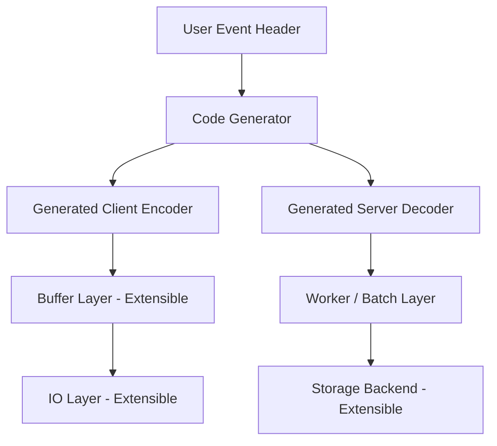
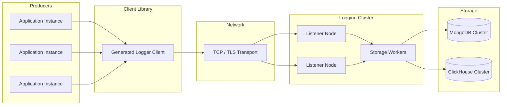
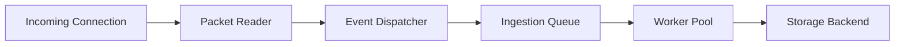
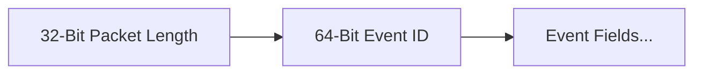
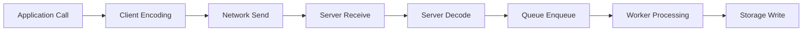
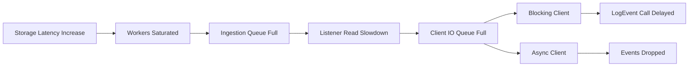
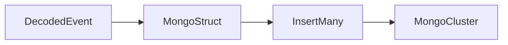
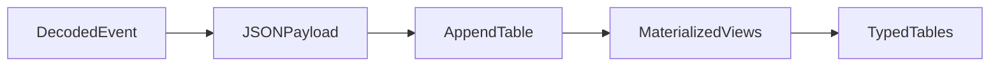
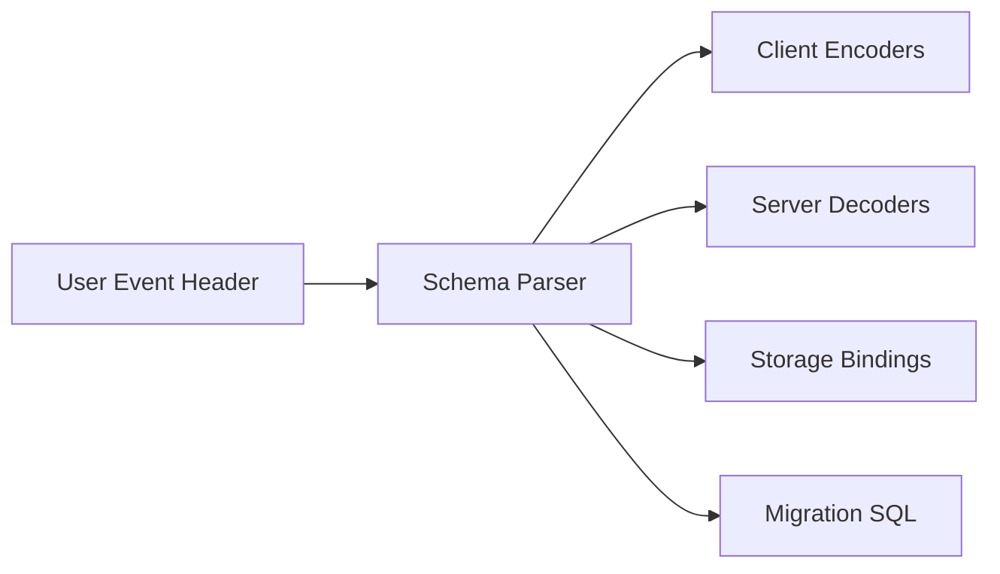

# 1. **System Overview**

Distributed Logger is a schema-driven event logging system that generates:

* Client encoders

* Server decoders

* Storage adapters

* Wire protocol bindings

The system is designed to:

* Minimize runtime reflection

* Provide compile-time event typing

* Support pluggable I/O and buffering

* Support multiple storage backends

* Maintain high throughput under sustained load

## 1.1 **High Level Architecture**

# 2. **Deployment Topology**

This diagram illustrates typical production deployment patterns.

## 2.1 **Scaling Model**

Horizontal scaling is achieved by:

* Adding listener nodes

* Adding worker goroutines

* Scaling storage clusters independently

# 3. **Runtime Concurrency Model**

The system uses structured concurrency to isolate network ingestion from storage latency.

## 3.1 **Concurrency Characteristics**
**Connection Level**

Each connection runs:

* Packet framing

* Event decoding

* Dispatch routing

**Worker Pool**

Workers:

* Perform storage operations

* Provide natural batching opportunities

* Isolate storage latency
# 4. **Wire Protocol**

The wire protocol is length-prefixed and schema-driven.
##  4.1 **Packet Structure**

## 4.2 **Encoding Strategy**

* Event layout is generated at build time

* Field types are known statically

* TLV metadata is intentionally removed to reduce overhead

## 4.3 **Reliability Assumptions**

The protocol assumes:

* Reliable TCP transport

* Connection break implies unrecoverable packet loss

* Clients re-establish connections

# 5. **Performance Model**

This section models latency and throughput behavior.
## 5.1 **Latency Path**

**Latency Components**
| Stage    | Dominant Cost     |
| -------- | ----------------- |
| Encoding | Memory copy       |
| Network  | RTT / congestion  |
| Decoding | Memory + parsing  |
| Queueing | Contention / load |
| Storage  | Backend dependent |

## 5.2 **Throughput Model**

Throughput depends on:

* Worker pool size

* Storage write capacity

* Network bandwidth

* Event payload size
# 6. **Overload Control and Backpressure**

Distributed Logger supports two complementary overload protection strategies depending on client and I/O implementation.

## 6.1 **Backpressure Mode (Blocking)**

In blocking transport implementations, event submission slows the application when downstream components are saturated.

This occurs when:

* Network buffers are full

* Server queues are saturated

* Storage latency increases
**Result**

`LogEvent()` call blocks until capacity becomes available.

**Guarantees**

* No event loss

* Increased application latency under load
## 6.2 **Load Shedding Mode (Dropping)**

Asynchronous transports implement bounded internal queues.
When queues reach configured capacity, new events are discarded.

Each I/O implementation exposes:
`QueueSize()`
When queue size exceeds limits:

* Event buffers are dropped

* `LogEvent()` returns immediately

**Guarantees**

* Application latency remains stable

* Event loss is possible during overload

## 6.3 **Client Implementation Behavior**
| Client Implementation | Overload Behavior |
| --------------------- | ----------------- |
| Blocking POSIX        | Backpressure      |
| Epoll-based           | Queue drop        |
| Seastar               | Queue drop        |
| Custom I/O            | User-defined      |

## 6.4 **Design Rationale**

Logging systems must avoid destabilizing primary workloads.
Allowing both modes enables users to choose:

* Data completeness

* Application latency stability

# 7. **Storage Architecture**

Storage adapters are generated per event type.
## 7.1 **MongoDB Path**

**Mongo Characteristics**

* Flexible schema

* Lower ingestion latency

* Higher write amplification under load

# 7.2 **ClickHouse Path**

**ClickHouse Characteristics**

* Append-only ingestion

* High analytical performance

* Materialized view extraction

# 8. **ClickHouse Storage Design**

Primary ingestion table contains:

* Event ID column

* JSON payload column

* Materialized views extract typed columns.

## 8.1 **Rationale**

Advantages:

* Avoids schema migration friction

* Allows event evolution

* Preserves ingestion throughput
# 9. **Generator Pipeline**

Code generation transforms event schema into system artifacts.

# 10. **Extensibility Points**

Users can customize:

* Network I/O implementation

* Buffer strategy

* Storage backends

* Transport layer (TCP / TLS / future protocols)

# 11. **Failure Model**

The system assumes:

* Transport failures cause packet loss

* Storage failures propagate via worker errors

* Retry strategies are backend-specific
# 12. **Future Directions**

Planned enhancements include:

* Per-event typed ingestion pipelines

* Additional client languages

* Advanced batching strategies

* Streaming storage connectors
# 13. **Design Principles**

The project prioritizes:

* Compile-time safety

* Predictable performance

* Minimal runtime reflection

* Explicit schema ownership

* Pluggable infrastructure components
# 14. **Summary**

Distributed Logger is designed as a high-performance schema-driven event ingestion system capable of supporting heterogeneous storage backends while maintaining predictable runtime behavior.
