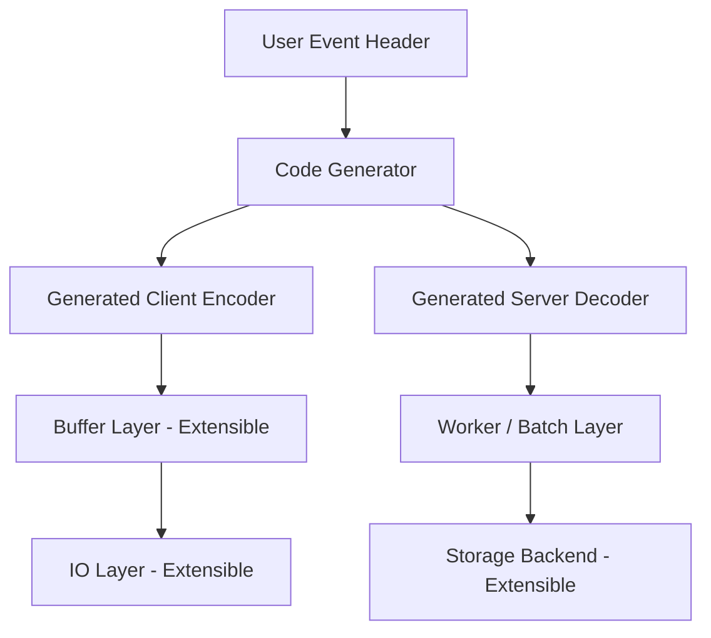

```mermaid
flowchart TD

A[User Event Header] --> B[Code Generator]

B --> C[Generated Client Encoder]
B --> D[Generated Server Decoder]

C --> E[Buffer Layer - Extensible]
E --> F[IO Layer - Extensible]

D --> G[Worker / Batch Layer]
G --> H[Storage Backend - Extensible]
```
