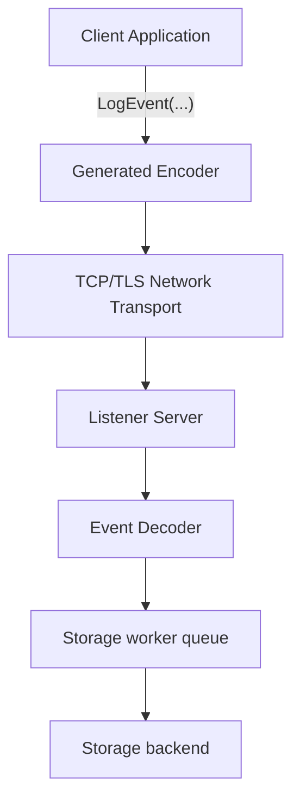

**MongoDB**

Distributed Logger is designed to support **multiple storage backends** while keeping the **client API identical**. The ingestion server receives events from clients and routes them to the configured storage backend.

The system currently supports:

MongoDB

ClickHouse

Both backends are optimized for **high-throughput append-only logging workloads**, but their internal storage models differ significantly.

**Ingestion Pipeline Overview**

The server decodes events and passes them to storage workers responsible for batching and writing to the configured backend.

**MongoDB Storage Model**
For MongoDB, events are stored directly as documents.

Example event:
`{
  "event": "event0",
  "Shard": 3,
  "Host": "node-1",
  "Parameter1": "value",
  "Parameter2": 42,
  "Timestamp": 1710000000
}`

Characteristics:

* flexible schema

* no pre-defined structure required

* efficient for moderate ingestion rates

* easy ad-hoc querying

MongoDB is therefore a good default for:

* operational logging

* debugging

* moderate-scale telemetry

**ClickHouse Storage Model**

ClickHouse is optimized for **analytical workloads and very large datasets**. However it requires a predefined schema.

To maintain flexibility while supporting heterogeneous event structures, Distributed Logger uses a **two-stage ingestion architecture**.

**Raw Event Table**

All events are first written to a single append-only table.

Example schema:
`CREATE TABLE events_raw
(
    event UInt64,
    payload String
)
ENGINE = MergeTree
ORDER BY tuple()`

Where:

* `event` identifies the event type

* `payload` contains the full event encoded as JSON

Example record:

`event:   0
payload: {"Shard":3,"Host":"node-1","Parameter1":"value","Parameter2":42}`

Advantages:

* supports arbitrary event schemas

* very simple ingestion path

* avoids schema migrations

**Materialized Views**

Per-event tables are populated automatically using materialized views.

Example:
`CREATE MATERIALIZED VIEW mv_events_event0
TO events_event0
AS
SELECT
    JSONExtractUInt(payload, 'Shard') AS Shard,
    JSONExtractString(payload, 'Host') AS Host
FROM events_raw
WHERE event = 0`

This creates a typed table optimized for analytics.
`events_event0`

Example schema:

`CREATE TABLE events_event0
(
    Shard UInt32,
    Host String
)
ENGINE = MergeTree
ORDER BY Shard`

This architecture allows:

* flexible ingestion

* efficient analytical queries

* automatic schema projection

**Performance Considerations**

ClickHouse performance strongly depends on **batch size**.

During testing the following observations were made:

|Configuration| Relative Throughput |
|-------------|---------------------|
|MongoDB      |	baseline            |
|ClickHouse (raw table only)|	~85–100% of Mongo|
|ClickHouse (raw + materialized views)|	~60% of Mongo|

This reduction occurs because materialized views perform additional work during each insert:

`insert
   ↓
write raw table
   ↓
execute materialized view
   ↓
write typed event table`

However this overhead enables efficient analytical queries.

**Recommended ClickHouse Configuration**

For high ingestion throughput:

batch inserts between **10k and 100k rows**

avoid extremely small insert batches

use append-only tables

Example configuration used during testing:

`batch_size = 10000
flush_interval = 10ms`

**When to Use Each Backend**

MongoDB is recommended for:

* operational logging

* moderate ingestion rates

* flexible event structures

* simple deployment

ClickHouse is recommended for:

* large telemetry streams

* analytical workloads

* long-term event storage

* large datasets with aggregation queries

**Future Optimization**

A future storage mode may allow **direct typed insertion into ClickHouse tables**, bypassing JSON extraction and materialized views. This would increase ingestion performance further at the cost of reduced schema flexibility.

**Design Goal**

The storage layer is intentionally designed so that:

* the **client API never changes**

* event schemas are defined **once in the header file**

* storage implementations can evolve independently

This allows applications to migrate from MongoDB to ClickHouse (or other backends) without modifying client code.
